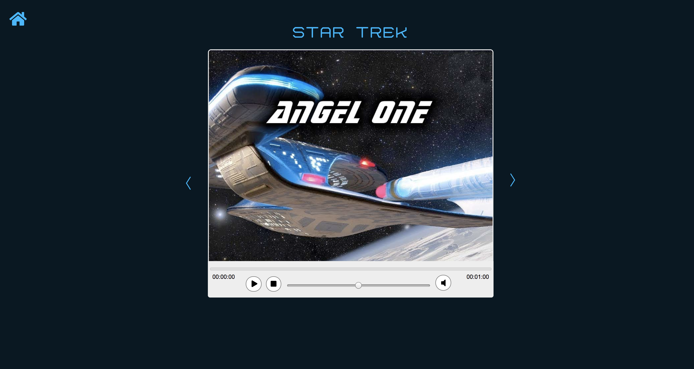

# Movielist

Applikation som visar filmer med videospelare.

**Följande tekniker används:**

- React
- Redux
- Node.js
- Express.js
- GraphQl
- SASS
- Webpack
- Babel

**Kod på GitHub:**

https://github.com/wallindaniel/movies

**Project på Heroku:**

https://topmovielibrary.herokuapp.com/

**För att köra projektet lokalt:**

- installera node.js
- npm install
- npm run start

**Övrigtt:**

Applikationen är optimerad för desktop och Chrome.

